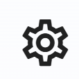
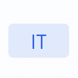
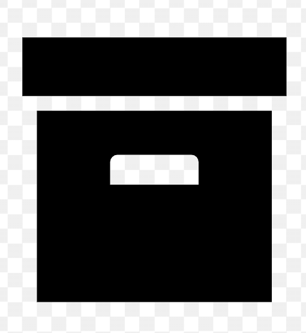
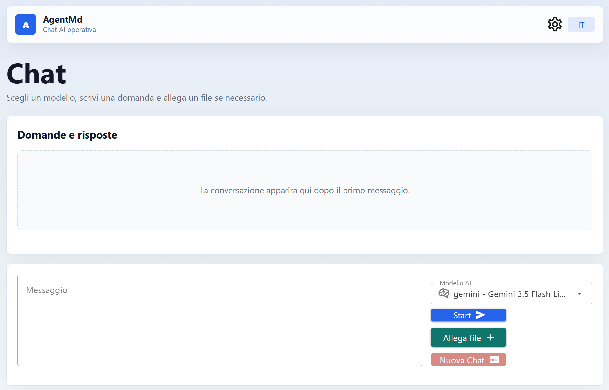
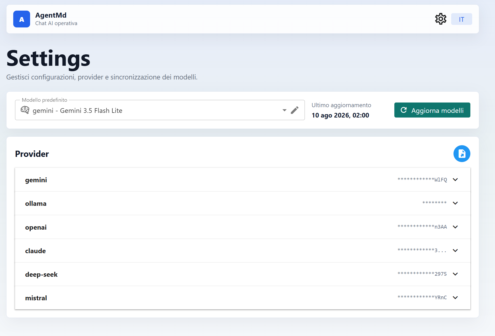
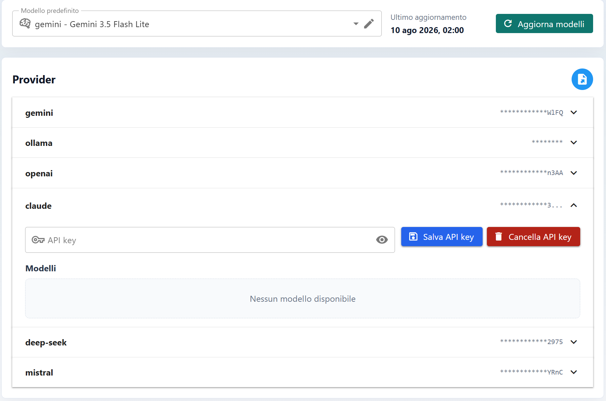

# AgentMd

The goal of this project is to provide a unified container for multiple AI providers, allowing users to choose and use the provider that best fits their needs.

Currently supported **AI providers** are:

* Gemini
* OpenAI
* DeepSeek
* Mistral
* Ollama (if installed locally)
* Claude

## Tech Stack

The project is built with:

* **Node.js** — minimum required version: **22**
* **npm**

## Installation

Clone the repository:

> git clone https://github.com/AntsugDev/as-agentmd

> npm install

Then build and link the package globally:

> npm run build && npm link

The server is **not started automatically** after installation. You can manually start or stop the server using the following command:

> agentmd server

To test whether the command works, you can also run:

> agentmd --help

If it responds, it displays the list of commands, which should include *server*.

By default, the server runs on port **1010**.

Once the server is running, open:

> http://localhost:1010

The frontend will be available at this address.

### Troubleshooting

If the `agentmd server` command does not work after installation and the build has completed successfully, check the following:

1. Run the command:

   > npm prefix -g

2. Copy the path returned by the command.

3. Add the copied path to your system's **PATH** environment variable.

4. Open a new terminal and try running the command again:

   > agentmd server

## Frontend Structure

The frontend consists of two main pages:

* **Home**
* **Settings**

### Settings

The **Settings** page allows you to:

* Check the AI providers and models currently available on the system.
* Update the available models.
* Configure your **API key** for providers that require one.
* Download/install available providers and models.

### Home

The **Home** page is the main chat interface.

It follows a familiar AI chat interface, providing:

* A text input for entering your questions or prompts.
* The ability to see the currently selected model and switch to another model using the model selector on the left side of the input field.
* Several buttons on the left side of the input field:

  * **Start** — starts the chat.
  * **Attach file** — allows you to attach a file. This option may not be available for all models.
  * **New chat** — starts a new conversation.

The top navigation bar also provides additional functionality:

*  — opens the **Settings** page.
*  — changes the application language (**Italian** or **English**).
*  — displays the **10 most recent chats**.

Below are some screenshots of the application:

---

## Notes

There are a few important things to keep in mind when using AgentMd.

### 1. API Keys and Provider Costs

With the exception of **Ollama**, all supported providers require an **API key**.

To obtain an API key, please refer to the official documentation of the provider you want to use.

Most providers require payment or operate on a pay-as-you-go basis. **Gemini** also provides a free tier, although it is subject to daily usage limits. Other providers are generally paid services, although the cost is typically relatively low depending on usage.

To use a specific provider/model, you must configure its API key from the **Settings** page:

1. Open **Settings**.
2. Select the desired provider from the list.
3. Enter your API key.
4. Save the configuration.

See the screenshot below:

### 2. API

AgentMd also provides a set of APIs that can be used to integrate its functionality into other applications.

The complete list of available APIs, together with their documentation and usage details, can be found here:

> http://localhost:1010/api-docs

### 3. Directory files

The files are saved in the operating system's temporary folder.
Inside it, you will find:
- `chat`: contains chat archive files
- `uploads`: contains files uploaded in chats
- `files`: a directory for temporary files that are immediately deleted

## License

This project is licensed under the **MIT License**.

Copyright (c) 2026 AntsugDev

## ☕ Support This Project

If you found this project useful and would like to buy me a coffee, you can do so by sending a donation via PayPal to:

👉  **antonio.sugamele@gmail.com**

Thank you!😄